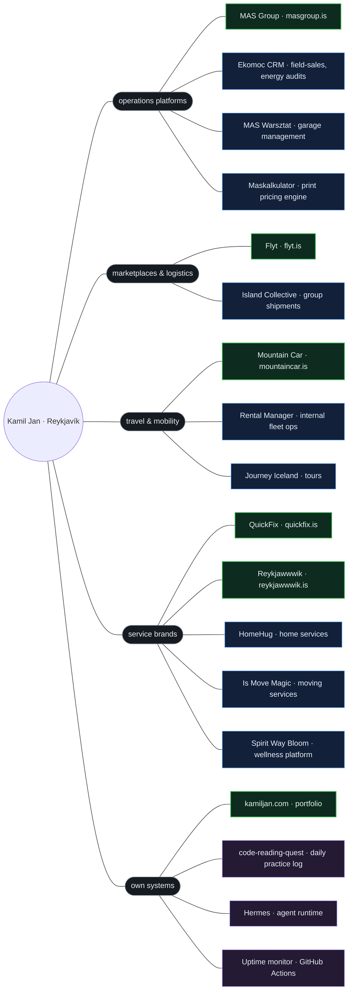

```
██╗  ██╗ █████╗ ███╗   ███╗██╗██╗              ██╗ █████╗ ███╗   ██╗
██║ ██╔╝██╔══██╗████╗ ████║██║██║              ██║██╔══██╗████╗  ██║
█████╔╝ ███████║██╔████╔██║██║██║              ██║███████║██╔██╗ ██║
██╔═██╗ ██╔══██║██║╚██╔╝██║██║██║         ██   ██║██╔══██║██║╚██╗██║
██║  ██╗██║  ██║██║ ╚═╝ ██║██║███████╗    ╚█████╔╝██║  ██║██║ ╚████║
╚═╝  ╚═╝╚═╝  ╚═╝╚═╝     ╚═╝╚═╝╚══════╝     ╚════╝ ╚═╝  ╚═╝╚═╝  ╚═══╝

   ·   ✦      .        ·          ✦     ·        .       ✦    ·
  ~~~≈≈≈≈~~~~~~~≈≈≈≈≈≈~~~~~~~≈≈≈≈~~~~~~~≈≈≈≈≈~~~~~~≈≈≈~~~~~~~~~~~~~
         /\                      /\
        /  \       /\           /  \      /\
       /    \     /  \    /\   /    \    /  \      /\
   ___/      \___/    \__/  \_/      \__/    \____/  \___

   builder & operator · reykjavík · ai in production for smes
```

I build software, automation and AI systems **in production** — and run the companies that use them every day.

🌐 **[kamiljan.com](https://kamiljan.com)** &nbsp;·&nbsp; ✉️ hello@kamiljan.com &nbsp;·&nbsp; 📖 daily code-reading log: [code-reading-quest](https://github.com/kamiljan11/code-reading-quest)

> ℹ️ Most repositories here are **private** — they hold client and proprietary code (ERPs, CRMs, pricing engines, automations).
> Everything below is real, **live** work. Green nodes are live sites — click them.

---

## 🚀 Live projects



**MAS Group** — B2B operations platform across auto parts, print and logistics. 13-stage quote-to-order pipeline, per-line pricing calculators, commission management, role-based access.

**Flyt** — group-order and import marketplace for Iceland. Pooled container campaigns with deposit/refund logic, on-demand import quotes, admin dashboard with live revenue metrics.

**Mountain Car** — car rental and garage near KEF airport. Fleet, booking and quote flow on Next.js + Supabase.

**QuickFix** — handyman brand in Reykjavík. Multilingual site (EN/PL/IS) plus lead funnel, shipped in 72 hours.

**Reykjawwwik** — web-agency SaaS. Multi-market pricing engine across 10 countries with geo-detection, lead-to-contract CRM, PDF contracts with per-country VAT.

**Ekomoc CRM** — field-sales CRM for energy-audit teams. 9-stage pipeline, role-based access, automated DOCX/PDF contract generation, leaderboard. _(private)_

---

## 🛠️ What I build with

**Product:** Next.js · React · TypeScript · Supabase · Vercel · Cloudflare Workers
**AI & automation:** n8n · RetellAI (voice agents) · WhatsApp bots · OpenAI / LLM + MCP integrations · fal.ai
**Plumbing:** Twilio · Google Apps Script · Playwright
**Growth:** Meta Ads · Google Ads · funnel & email systems

---

## 🤝 Work with me

I ship AI into production for SMEs — and train the teams that keep it running after I step away.

→ **[kamiljan.com](https://kamiljan.com)**
