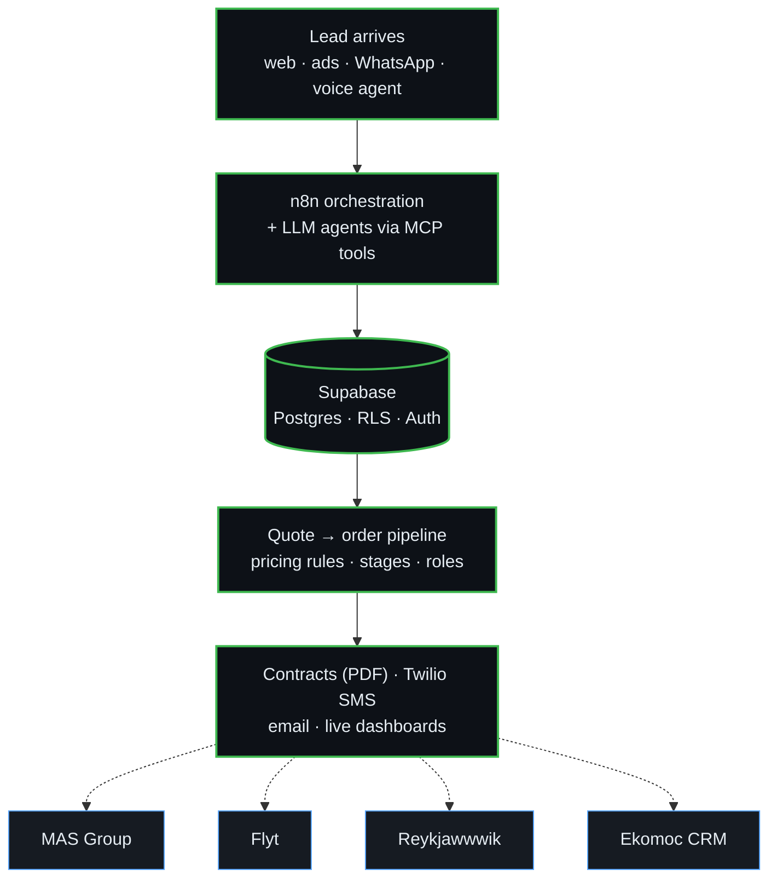

# Kamil Jan — Builder & Operator · Reykjavík 🇮🇸

I build software, automation and AI systems **in production** — and run the companies that use them every day.

🌐 **[kamiljan.com](https://kamiljan.com)** &nbsp;·&nbsp; ✉️ hello@kamiljan.com &nbsp;·&nbsp; 📖 daily code-reading log: [code-reading-quest](https://github.com/kamiljan11/code-reading-quest)

> ℹ️ Most repositories here are **private** — they hold client and proprietary code (ERPs, CRMs, pricing engines, automations).
> The list below is the real, **live** work. Click through and see it running.

---

## 🧭 How the systems fit together

Six businesses, one operating system. Every product below runs on the same spine — which is why one person can keep all of them in production.

---

## 🚀 Live projects

| Project | What it is | Live |
|---|---|---|
| **MAS Group** | B2B operations platform across auto parts, print & logistics — per-line pricing calculators, a 13-stage quote-to-order pipeline, commission management, role-based access | [masgroup.is](https://masgroup.is) |
| **Flyt** | Group-order & import marketplace for Iceland — pooled container campaigns with deposit/refund logic, on-demand import quotes, admin dashboard with live revenue metrics | [flyt.is](https://flyt.is) |
| **Mountain Car** | Car rental + garage near KEF airport — fleet, booking and quote flow (Next.js + Supabase) | [mountaincar.is](https://mountaincar.is) |
| **QuickFix** | Handyman brand in Reykjavík — multilingual marketing site (EN/PL/IS) + lead funnel, shipped in 72h | [quickfix.is](https://quickfix.is) |
| **Reykjawwwik** | Web-agency SaaS — multi-market pricing engine across 10 countries with geo-detection, lead-to-contract CRM, PDF contract generation with per-country VAT | [reykjawwwik.is](https://reykjawwwik.is) |
| **Ekomoc CRM** | Field-sales CRM for energy-audit teams — 9-stage pipeline, role-based access, automated DOCX/PDF contract generation, leaderboard | _private_ |

---

## 🛠️ What I build with

**Product:** Next.js · React · TypeScript · Supabase · Vercel · Cloudflare Workers
**AI & automation:** n8n · RetellAI (voice agents) · WhatsApp bots · OpenAI / LLM + MCP integrations · fal.ai
**Plumbing:** Twilio · Google Apps Script · Playwright
**Growth:** Meta Ads · Google Ads · funnel & email systems

---

## 🤝 Work with me

I ship AI into production for SMEs — and train the teams that keep it running after I step away.

→ **[kamiljan.com](https://kamiljan.com)**
