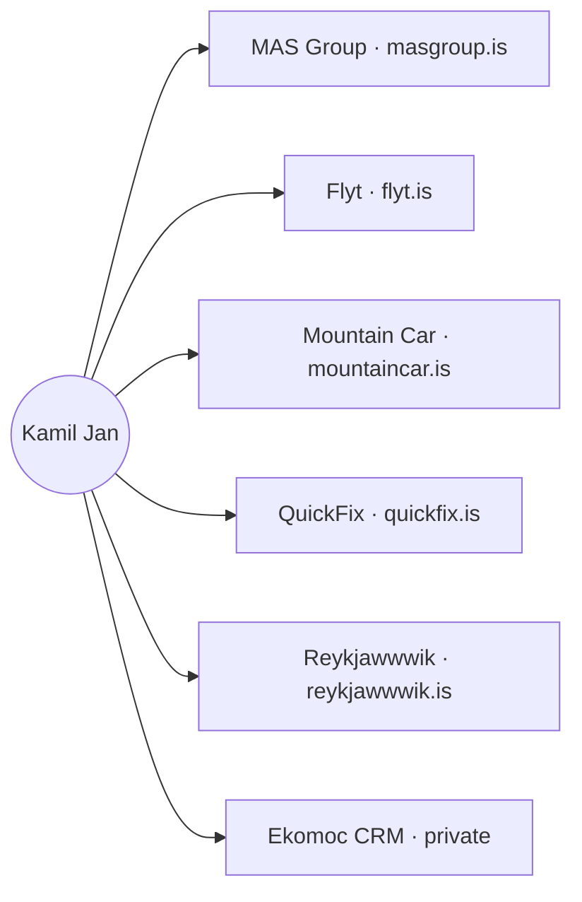
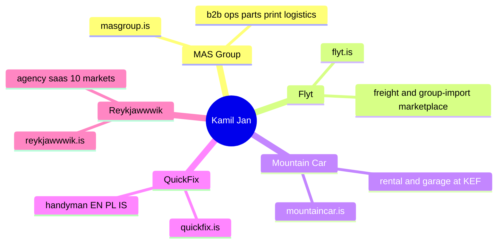
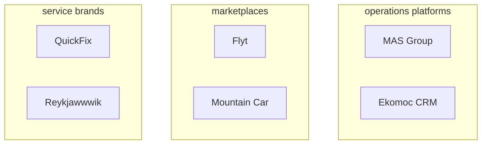

# mermaid variants (scratch)

## A — flowchart, single-line labels, clickable nodes

```mermaid
flowchart LR
    K(("Kamil Jan"))
    K --> MAS["MAS Group · masgroup.is"]
    K --> FLY["Flyt · flyt.is"]
    K --> MC["Mountain Car · mountaincar.is"]
    K --> QF["QuickFix · quickfix.is"]
    K --> RKW["Reykjawwwik · reykjawwwik.is"]
    K --> EKO["Ekomoc CRM · private"]

    click MAS "https://masgroup.is" _blank
    click FLY "https://flyt.is" _blank
    click MC "https://mountaincar.is" _blank
    click QF "https://quickfix.is" _blank
    click RKW "https://reykjawwwik.is" _blank
```

## B — mindmap

```mermaid
mindmap
  root((Kamil Jan))
    MAS Group
      b2b ops parts print logistics
      masgroup.is
    Flyt
      freight and group-import marketplace
      flyt.is
    Mountain Car
      rental and garage at KEF
      mountaincar.is
    QuickFix
      handyman EN PL IS
      quickfix.is
    Reykjawwwik
      agency saas 10 markets
      reykjawwwik.is
```

## C — flowchart with subgraph grouping

```mermaid
flowchart TB
    subgraph OPS["operations platforms"]
        direction LR
        MAS2["MAS Group"]
        EKO2["Ekomoc CRM"]
    end
    subgraph MKT["marketplaces"]
        direction LR
        FLY2["Flyt"]
        MC2["Mountain Car"]
    end
    subgraph SVC["service brands"]
        direction LR
        QF2["QuickFix"]
        RKW2["Reykjawwwik"]
    end
```
